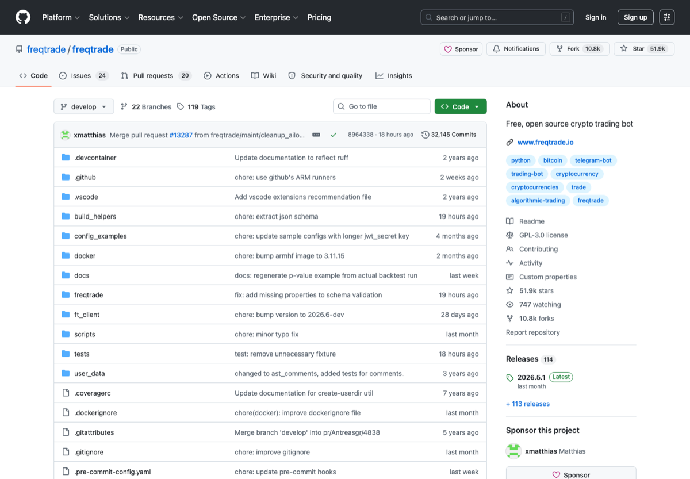

# Freqtrade Report Kit

Turn Freqtrade backtest JSON exports into clean Markdown, HTML, and CSV risk reports.

This is a small companion tool for the [Freqtrade](https://github.com/freqtrade/freqtrade) ecosystem. It is not affiliated with Freqtrade; it simply reads backtest-style JSON exports and turns them into reports that are easier to review, share, paste into Obsidian, or attach to a strategy README.

<p align="center">
  
</p>

<sub>Image source: public Freqtrade GitHub page screenshot, [https://github.com/freqtrade/freqtrade](https://github.com/freqtrade/freqtrade). Used as a visual reference for the backtesting/reporting ecosystem; this project is not affiliated with Freqtrade.</sub>

## Why This Exists

Freqtrade already gives serious traders a strong backtesting engine. The missing daily workflow is often the last mile:

- Which strategy actually won after drawdown is considered?
- Did the profit come from one lucky pair or broad pair contribution?
- Is the profit factor good enough, or is the curve just noisy?
- Can I paste the result into Obsidian, GitHub, Discord, or a research note without hand-formatting tables?

`freqtrade-report-kit` focuses on that review layer.

## Features

- Parse common Freqtrade backtest JSON layouts.
- Rank multiple strategies by return, drawdown, and realized profit.
- Generate Markdown reports for GitHub, Obsidian, Notion imports, and lab notes.
- Generate standalone HTML reports with no JavaScript dependency.
- Export strategy-level CSV for spreadsheet comparison.
- Summarize win rate, realized profit, max drawdown, profit factor, expectancy, Sharpe, Sortino, Calmar, market change, pair contribution, and trade samples.
- Add a risk review checklist so a pretty backtest does not become a reckless live-trading button.

## Quick Start

```bash
pipx install git+https://github.com/StaryMoon/freqtrade-report-kit.git
```

Or run from source:

```bash
git clone https://github.com/StaryMoon/freqtrade-report-kit.git
cd freqtrade-report-kit
python -m venv .venv
source .venv/bin/activate
pip install -e .
```

No-install smoke test:

```bash
PYTHONPATH=src python -m freqtrade_report_kit.cli examples/backtest-result.sample.json --print
```

Generate a report:

```bash
ft-report-kit examples/backtest-result.sample.json \
  --output reports/sample-report.md \
  --html reports/sample-report.html \
  --csv reports/sample-summary.csv
```

Print the report in terminal:

```bash
ft-report-kit examples/backtest-result.sample.json --print
```

## Example Output

The generated Markdown report starts like this:

```markdown
# Freqtrade Backtest Risk Report

## Executive Summary

- Best strategy by return: **MomentumScalper**
- Return: **18.24%**
- Realized profit: **182.4200 USDT**
- Max drawdown: **11.80%**
- Profit factor: **1.740**
- Risk label: **Clean candidate**
```

See [`reports/sample-report.md`](reports/sample-report.md) for a full generated report.

## Input Format

The parser is intentionally tolerant. It supports common shapes such as:

```json
{
  "strategy": {
    "MyStrategy": {
      "total_trades": 42,
      "wins": 25,
      "losses": 17,
      "profit_total_abs": 123.45,
      "profit_total": 0.1234,
      "max_drawdown": 0.084,
      "profit_factor": 1.45,
      "results_per_pair": [],
      "trades": []
    }
  }
}
```

It also accepts single-strategy files where metrics live at the root.

## CLI

```bash
usage: freqtrade-report-kit [-h] [-o OUTPUT] [--html HTML] [--csv CSV] [--print] input

Generate clean risk reports from Freqtrade backtest JSON exports.

positional arguments:
  input                 Path to a Freqtrade backtest JSON export.

options:
  -o, --output OUTPUT   Markdown output path.
  --html HTML           Optional HTML output path.
  --csv CSV             Optional strategy summary CSV output path.
  --print               Print the Markdown report to stdout after writing files.
```

## Good Use Cases

- You are testing many Freqtrade strategies and want a compact ranking page.
- You want every backtest to produce an Obsidian note.
- You maintain a public strategy repo and want readable report artifacts.
- You want to compare return against max drawdown before getting emotionally attached to a curve.
- You want a small reporting layer that is easy to customize.

## Not Financial Advice

This project is a reporting utility. It does not predict markets, recommend assets, place orders, manage money, or guarantee profit. Always run paper trading and out-of-sample checks before considering any live deployment.

## Relationship To Freqtrade

Freqtrade is the upstream trading bot/backtesting ecosystem that inspired this tool. This repository is an independent companion utility and does not vendor or modify Freqtrade code. If you use Freqtrade, star and follow the official project first:

- https://github.com/freqtrade/freqtrade
- https://www.freqtrade.io/

## Roadmap

- [ ] Parse more exact Freqtrade export variants from real-world samples.
- [ ] Add equity curve extraction when time-series fields are available.
- [ ] Add PNG chart export for README badges and social sharing.
- [ ] Add GitHub Action example for auto-generating reports after backtests.
- [ ] Add optional Streamlit viewer for local exploration.

## License

MIT.
